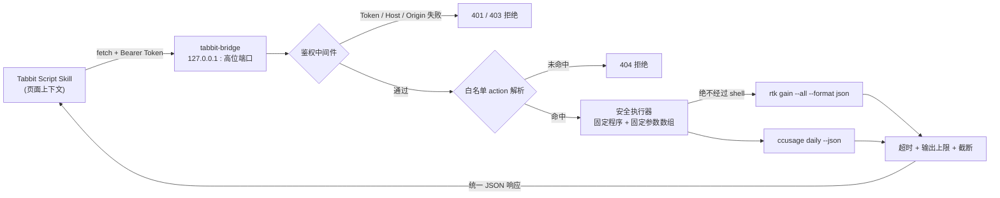

# **tabbit-bridge 技术开发方案 (v1.0)**

## **0. 本文件如何使用**

这是一份面向 AI 编码代理的实现规格（spec-driven）。AI 应严格遵循其中的「硬性要求」与「验收标准」产出代码，对未明确的细节可在不违背安全原则的前提下自行决策，但**任何涉及命令执行、鉴权、网络监听的决策必须遵守第 7 章**。最终交付物见第 18 章。

## **1. 项目背景与目标**

`tabbit-bridge` 是一个运行在用户本机的微型本地服务，作为 Tabbit 浏览器（基于 Chromium）页面脚本与本地 CLI 工具之间的安全桥梁。它的首要服务对象是 `rtk`（Rust 编写的 CLI 代理，输出 token 节省统计）和 `ccusage`（统计各 AI CLI 的用量与成本），未来可扩展更多受控 CLI。

核心目标有四条，且**优先级从高到低**为：**安全 > 静默 > 低资源 > 易扩展**。安全是不可妥协的底线；在安全成立的前提下追求几乎零感知的后台运行、极低的内存与 CPU 占用，以及通过修改白名单即可接入新指令的扩展性。

## **2. 关键约束与设计前提**

有一个架构事实必须在开工前确认：Tabbit 的脚本妙招运行在**网页页面上下文**，无法访问 `chrome.runtime` API，因此 Chrome 官方的 Native Messaging 方案在此场景**不可用**。本项目采用 **`127.0.0.1` 本地 HTTP 网关**作为唯一可行路径，并通过多层防御把它的安全性做到逼近 Native Messaging 的水平。

信任模型必须如实写入 README：由于 token 需要嵌入妙招代码，本方案的安全前提是**个人本机使用**，不适合把含 token 的妙招公开分发。若未来要做成面向他人分发的产品能力，需另起基于浏览器扩展 + Native Messaging 的方案。

## **3. 总体架构**



整条链路的不可动摇原则：**客户端只发送 `action` 标识符，永远拿不到也拼不出真实系统命令**；命令真身被固化在编译后的二进制中。

## **4. 功能需求 (FR)**

| 编号 | 功能 | 说明 |
| :--- | :--- | :--- |
| FR-1 | 健康探活 | `GET /healthz` 返回服务状态与版本，无需鉴权 |
| FR-2 | 受控命令执行 | `POST /v1/exec` 接收 `action`，执行白名单中对应命令并返回结果 |
| FR-3 | 白名单注册表 | 编译期静态映射 `action → (程序, 固定参数)`，新增需改代码重编译 |
| FR-4 | 首次自举 | 启动时若无配置则自动生成端口、token 并写入 `config.toml` |
| FR-5 | 后台守护 | 提供注册/注销为 macOS launchd、Linux systemd user、Windows service 的能力 |
| FR-6 | 一键安装 | 提供 `install.sh` 与 `install.ps1`，完成下载、配置、守护注册、打印 token |

## **5. 非功能需求 (NFR)**

性能与静默是硬指标：空闲常驻内存须 **< 8MB**，空闲 CPU 占用约为 0；二进制为单文件、**无外部动态依赖**，体积控制在约 2\~4MB；后台运行**无窗口、无 Dock 图标、无主动弹窗**；单条命令执行须有超时（默认 5000ms）与输出上限（默认 2MB）兜底，绝不因某条命令卡死或输出爆炸而拖垮服务。

## **6. 技术选型**

| 维度 | 选型 | 理由 |
| :--- | :--- | :--- |
| 语言 | Rust（edition 2021/2024） | 与 `rtk` 同源；无 GC、内存安全；单文件零依赖 |
| HTTP | `tiny_http` | 同步阻塞、依赖极少、二进制最小，空闲近零 CPU |
| 序列化 | `serde` + `serde_json` | 与 `rtk` / `ccusage` 的 `--json` 输出无缝衔接 |
| 配置 | `toml` | 人类可读的本地配置 |
| 随机数 | `getrandom` | 生成 256-bit token |
| 常量时间比较 | `subtle` | token 比对防时序攻击 |
| 进程超时 | `wait-timeout` | 防命令卡死 |
| Windows 服务 | `windows-service` + `#![windows_subsystem="windows"]` | 后台服务、彻底无黑窗 |

明确要求 AI **不要引入 `tokio`/`axum` 等异步重型栈**，以保证最小体积与最低占用；除上表外不得新增运行时依赖。

## **7. 安全设计（核心 · 纵深防御四层）**

这是全项目重心，四层叠加，任一层被绕过仍有兜底。

**第一层 · 网络隔离。** 只 `bind` 到 `127.0.0.1`，**严禁监听 `0.0.0.0`**；端口为安装时随机生成的高位端口（40000\~60000），降低被扫描命中的概率。

**第二层 · 密钥鉴权（主闸门）。** 安装时生成 256-bit 随机 token，写入权限 `0600` 的配置文件；所有受保护请求必须带 `Authorization: Bearer <token>`，服务端用 `subtle` **常量时间比较**校验，错误或缺失返回 `401`。token 是这套体系真正的锁。

**第三层 · 防 DNS 重绑定 + CORS/PNA。** 校验 `Host` 头必须为 `127.0.0.1:<port>` 或 `localhost:<port>`，否则 `403`；正确处理 `OPTIONS` 预检，并针对 Chromium 私有网络访问策略返回 `Access-Control-Allow-Private-Network: true`，否则高版本内核会拦截 HTTPS 页面对本地接口的请求。

**第四层 · 白名单 + 无 shell 执行。** 客户端只能传 `action`；执行时用 `std::process::Command::new(程序).args(固定参数数组)`，**绝不使用 `sh -c` 或任何字符串拼接**，从根本上消灭命令注入。

工程兜底：以**普通用户身份**运行（绝不 root/管理员）；每条命令施加超时与输出上限；可选每分钟限流与审计日志（默认仅记录 action 与耗时，不记录输出内容）。

## **8. 白名单与受控参数设计**

白名单为编译期静态映射，新增指令必须改代码、重新编译——这正是「固化」的体现：

```rust
// registry.rs —— 编译期固化白名单
// 客户端只能传 id，真正的程序与参数在此写死
fn resolve(id: &str) -> Option<(&'static str, &'static [&'static str])> {
    match id {
        "rtk_gain"     => Some(("rtk",     &["gain", "--all", "--format", "json"])),
        "rtk_discover" => Some(("rtk",     &["discover", "--all", "--since", "7"])),
        "cc_daily"     => Some(("ccusage", &["daily", "--json"])),
        "cc_monthly"   => Some(("ccusage", &["monthly", "--json"])),
        _ => None, // 未命中一律拒绝
    }
}
```

若某 action 确需动态参数（如按日期查 `ccusage`），**不得拼字符串**，而须用「受控参数」模式：只接受经强类型/正则约束的值（如日期须匹配 `^\d{4}-\d{2}-\d{2}$`），作为**独立 argv 元素**传入，且仅对显式开放的 action 生效，不符格式直接拒绝。

关于 `ccusage` 的性能：官方推荐 `npx ccusage@latest`，但 `npx` 冷启动慢。为追求毫秒级响应，建议全局安装（`npm i -g ccusage`）后直接调用 `ccusage`，或在白名单写死其绝对路径；`rtk` 为原生二进制可直接调用。

## **9. HTTP API 规范**

接口保持极简，统一响应结构便于脚本解析。

`GET /healthz`（免鉴权）：
```json
{ "status": "ok", "version": "1.0.0" }
```

`POST /v1/exec`（需 `Authorization: Bearer <token>`），请求体：
```json
{ "action": "rtk_gain" }
```

统一响应（命中 JSON 命令时 `data` 为解析后对象，否则原始文本放入 `raw`）：
```json
{
  "ok": true,
  "action": "rtk_gain",
  "exit_code": 0,
  "data": { },
  "raw": null,
  "stderr": "",
  "duration_ms": 8,
  "truncated": false
}
```

错误码约定：`401` 鉴权失败、`403` Host 校验失败、`404` 非法 action、`408` 命令超时、`500` 执行错误。

## **10. 配置文件规范**

安装时自动生成 `config.toml`（macOS 置于 `~/Library/Application Support/tabbit-bridge/`，Linux 置于 `~/.config/tabbit-bridge/`，权限 `0600`）：

```toml
[server]
bind = "127.0.0.1"
port = 47113                 # 安装时随机生成的高位端口
token = "安装脚本生成的 256-bit hex"

[limits]
timeout_ms = 5000
max_output_bytes = 2000000
rate_per_min = 60
```

## **11. 项目结构**

```
tabbit-bridge/
├── Cargo.toml
├── src/
│   ├── main.rs        # 加载配置、启动 HTTP、装载守护
│   ├── config.rs      # 读取/首次生成 config.toml 与 token
│   ├── server.rs      # 路由 + 鉴权 + CORS/PNA + Host 校验
│   ├── registry.rs    # 编译期白名单（见第 8 章）
│   ├── exec.rs        # 安全执行：无 shell、超时、输出截断
│   └── service.rs     # 各平台守护进程注册/注销
├── scripts/
│   ├── install.sh     # macOS / Linux 一键安装
│   └── install.ps1    # Windows 一键安装
├── .github/workflows/release.yml   # 跨平台交叉编译并发布 Release
└── README.md          # 含信任模型与边界说明
```

## **12. 各模块实现要求**

`config.rs` 负责自举：不存在则生成端口与 token 并以 `0600` 写盘，存在则加载校验。`server.rs` 实现路由与鉴权中间件，顺序为「Host 校验 → OPTIONS 预检短路 → Bearer 校验 → action 路由」，任何一步失败立即返回对应错误码。`exec.rs` 是安全核心，必须用 `Command` + 参数数组 + `wait-timeout`，并在读取 stdout 时按 `max_output_bytes` 截断、置 `truncated=true`。`service.rs` 提供三平台守护进程的注册与注销函数。所有模块禁止 `unsafe`，禁止把 token 或命令输出写入日志。

## **13. 跨平台静默守护**

- **macOS**：生成 `~/Library/LaunchAgents/com.tabbit.bridge.plist`，`launchctl load` 随登录自启，无 Dock 图标、无窗口。
- **Linux**：用户级 `systemd`，`~/.config/systemd/user/tabbit-bridge.service` + `systemctl --user enable --now`。
- **Windows**：编译加 `#![windows_subsystem = "windows"]` 杜绝黑窗；用 `windows-service` 注册为后台服务，或退化为登录时运行的隐藏计划任务。

## **14. 安装与分发**

二进制用 GitHub Actions 交叉编译四目标：`aarch64-apple-darwin`、`x86_64-apple-darwin`、`x86_64-unknown-linux-musl`、`x86_64-pc-windows-msvc`，挂到 Releases。安装脚本完成四步：检测平台下载二进制 → 生成随机端口与 token 写入配置 → 注册后台守护并立即启动 → 在终端打印 token 供填入妙招。

```bash
# macOS / Linux
curl -fsSL https://<your-release>/install.sh | sh
```
```powershell
# Windows（管理员 PowerShell）
iwr -useb https://<your-release>/install.ps1 | iex
```

## **15. Tabbit 端集成（脚本妙招）**

在 Tabbit 灯泡面板创建脚本妙招，填入下列代码并设好生效范围；`TOKEN` 填安装时打印的值：

```javascript
(async () => {
  const BASE = 'http://127.0.0.1:47113';
  const TOKEN = '把安装时打印的 token 填这里';

  const exec = async (action) => {
    const r = await fetch(`${BASE}/v1/exec`, {
      method: 'POST',
      headers: {
        'Content-Type': 'application/json',
        'Authorization': `Bearer ${TOKEN}`,
      },
      body: JSON.stringify({ action }),
    });
    if (!r.ok) throw new Error(`bridge ${r.status}`);
    return r.json();
  };

  try {
    const [gain, daily] = await Promise.all([exec('rtk_gain'), exec('cc_daily')]);
    console.log('rtk:', gain.data, 'ccusage:', daily.data);
    // 此处用 DOM 渲染浮窗展示 gain.data 与 daily.data
  } catch (e) {
    console.error('无法连接 tabbit-bridge，请确认服务已启动：', e);
  }
})();
```

## **16. 开发里程碑**

建议分四个阶段交付，每阶段可独立验证：

第一阶段先打通最小闭环——`config.rs` 自举 + `tiny_http` 起服务 + `/healthz` + 单个 `rtk_gain` 白名单 + 无 shell 执行，本地能用正确 token 取到真实数据即可。第二阶段补齐安全——Bearer 鉴权、Host 校验、CORS/PNA、超时与输出上限。第三阶段做守护与安装——三平台 `service.rs` 与两份安装脚本。第四阶段做工程化——GitHub Actions 交叉编译、README 信任模型说明、验收测试全绿。

## **17. 验收标准与测试用例**

1. 携带正确 token 调用 `rtk_gain`，返回 `ok:true` 且 `data` 为解析后的 JSON 对象。
2. 错误或缺失 token 返回 `401`；token 比对经确认为常量时间实现。
3. 非白名单 action（如 `rm_rf`）返回 `404`，且服务不执行任何系统调用。
4. 伪造 `Host` 头（如 `evil.com`）的请求返回 `403`。
5. `OPTIONS` 预检返回包含 `Access-Control-Allow-Private-Network: true` 的正确 CORS 头。
6. 构造超时命令验证 5s 超时生效返回 `408`；构造超大输出验证截断且 `truncated:true`。
7. 空闲常驻内存 < 8MB；`ldd`/依赖检查确认二进制无外部动态依赖。
8. 三平台守护进程能正确注册、开机自启、注销，且运行期无窗口无图标。

## **18. 交付物清单**

完整可 `cargo build` 的 Rust 工程（含 `Cargo.toml` 与全部源码模块）、`install.sh` 与 `install.ps1`、`.github/workflows/release.yml`、以及包含安装步骤与信任模型边界说明的 `README.md`。
